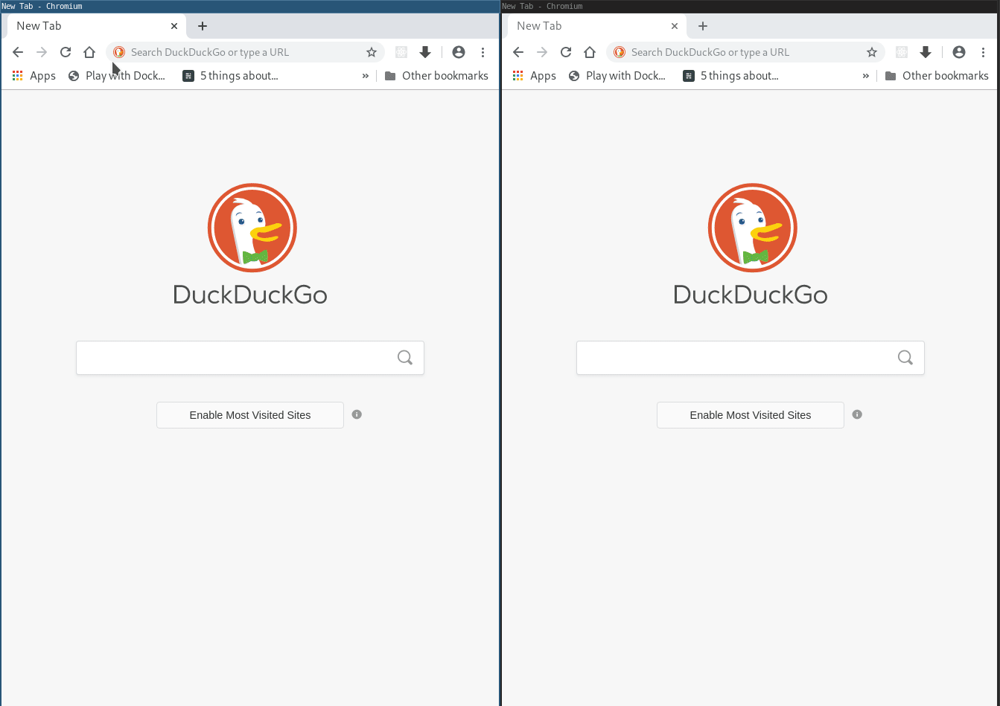

## Memory Game - a multiplayer web application.

The memory game is a multiplayer game in which the goal is to match pairs of cards.

This implementation uses Spring Boot on the back-end and ReactJS in the browser. Communication between these two components is effected using a mixture of REST and WebSockets - which enables live screen updates for players.

### Preliminaries

First, choose a name.

(Please note, the game has no security and many players can choose the same name - the results of which might be confusing!)

Before play can begin players must find an opponent. This can be done in two ways:

1. Post a 'seek'. Seeks advertise a player's willingness to play a game. When a player posts a seek they also have to declare how many pairs of cards the game will consist of.

2. Accept another player's seek. Whenever a seek is accepted, the game begins.

Seeks that are not accepted are automatically purged after 20 minutes.

### Play

At the beginning of the game cards are randomly dealt face down. Each player takes turns to reveal cards, two at a time. If the cards match, that player scores a point and takes another turn, otherwise it is the opposing player's turn. Play continues until all of the cards are face up.

### Installation

Ensure that Java, Maven, npm and node are available on your system.
 
1. Install the JavaScript dependencies:

   `$ npm install`

2. Build the JavaScript bundle:

   `$ npm run build`

3. Start the spring-boot application:

   `$ mvn spring-boot:run`

4. Connect locally by navigating to http://localhost:8080 in a browser.

   Remote devices: connect to port 8080 using the IP address of the machine serving the application.

5. Open another browser window, and play against yourself.

6. Get others to connect.

7. Player against others!

### Demonstration

### UI

The web front-end is just a free-floating ReactJS application running in the browser. User actions are relayed to the application using a REST API.

The UI subscribes to important events using websockets. This way, players get board updated as soon as their opponents make a move.

### REST API

...docs yet to be completed. But...

For an overview of all of the available REST methods available to the UI, please examine the file src/main/js/rest/rest.js

